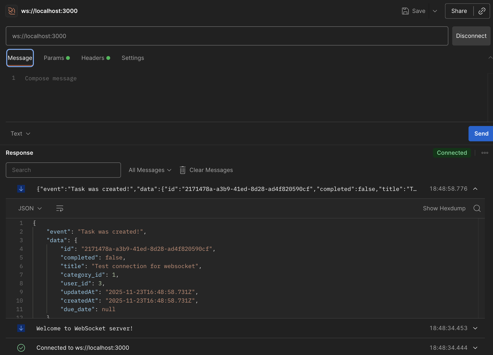

# Lab №3: Authentication and Authorization

## Project Background

The current project is a continuation of the development started in the [node-toDo-app-db](https://github.com/acetvertacova/node-toDo-app-db) repository.

---

## 🎯 Objective

- Learn methods of authentication and authorization in backend applications using Node.js.
- Implement REST API protection using JWT (JSON Web Token).
- Learn to restrict access to resources based on user roles.


---

## Installation and Project Launch Instructions

1. Install Node.js

    Make sure you have Node.js installed. Check your version:
   
```
    node -v
    npm -v
```

2. Clone or Download the Project

```
   git clone <repo-url>
   cd <your-project-folder>
```

3. Install Dependencies

```
    npm install
```

4. Run migrations

```
    npx sequelize-cli db:migrate
```

5. Start the server

```
    npm run dev
```

---

## Project's Structure

    node-toDo-app-db/
    ├── config/
    │   └── config.js                    # Database configuration for Sequelize
    ├── middleware/                      # Custom middleware 
    │   ├── asyncWrapper.js     
    │   ├── errorHandler.js     
    │   ├── requestLogger.js      
    │   └── auth.js                      
    │
    ├── errors/                          # Custom validation
    │   ├── 404/   
    │   │   ├── CategoryNotFound.js  
    │   │   ├── ToDoNotFound.js                         
    │   │   └── UserNotFound.js                                               
    │   ├── AppError.js     
    │   ├── AuthenticationError.js     
    │   ├── NotFoundError.js      
    │   └── ValidationError.js       
    │   
    ├── utils/  
    │   └── logger.js     
    │  
    ├── controllers/
    │   ├── CategoriesController.js      # Handles category-related logic
    │   ├── UserController.js            # Handles user-related logic
    │   └── TodoController.js            # Handles todo-related logic
    │
    ├── migrations/
    │   ├── 20251026143524-create-category.js  # Migration for creating 'Category' table
    │   ├── 20251026143744-create-user.js      # Migration for creating 'User' table
    │   └── 20251026143745-create-todo.js      # Migration for creating 'Todo' table
    │
    ├── models/
    │   ├── category.js                  # Sequelize model for Category
    │   ├── user.js                      # Sequelize model for User
    │   ├── todo.js                      # Sequelize model for Todo
    │   └── index.js                     # Model initialization and associations
    │
    ├── routes/
    │   ├── CategoryRoute.js             # Routes for categories
    │   ├── UserRoute.js                 # Routes for users
    │   ├── TodoRoute.js                 # Routes for todos
    │   └── swaggerDocs.js               # Swagger documentation routes
    │
    ├── seeders/
    │   ├── 20251026151718-demo-categories.js  # Seeds demo data for categories
    │   ├── 20251026151812-demo-user.js        # Seeds demo data for users
    │   └── 20251026151800-demo-todos.js       # Seeds demo data for todos
    │
    ├── swagger/
    │   └── swagger.js                   # Swagger configuration for API docs
    │
    ├── validators/                          # Custom validators
    │   ├── categories/   
    │   │   ├── createValidator.js  
    │   │   ├── getByIdValidator.js                         
    │   │   └── updateValidator.js  
    │   ├── toDos/
    │   │   ├── createValidator.js  
    │   │   ├── getByIdValidator.js 
    │   │   ├── getAllValidator.js                          
    │   │   └── updateValidator.js    
    │   ├── users/ 
    │   │   ├── loginValidator.js 
    │   │   └── registrationValidator.js  
    │   └── handleValidationError.js
    ├── websocket/
    │   ├── index.js  
    │   └── notifyClient.js        
    │  
    ├── .gitignore                       # Git ignore file
    ├── app.js                           # Main entry point of the application
    ├── example.env                      # Example environment configuration
    ├── package.json                     # Project metadata and dependencies
    ├── package-lock.json                # Dependency lock file
    └── README.md                        # Project documentation

---

## Example Usage

---

### Step 1: Database 


Add a new `users` table and establish a relationship with the `todos` table.

### Users Table

| Field       | Type         | Description                        |
|------------ |------------ |---------------------------------- |
| id          | SERIAL (PK) | Unique identifier for the user     |
| username    | VARCHAR(50) | Unique username                    |
| email       | VARCHAR(100)| User email (unique)                |
| password    | TEXT        | Password hash                      |
| role        | VARCHAR(20) | User role (`user`, `admin`)        |
| created_at  | TIMESTAMP   | Registration date                  |
| updated_at  | TIMESTAMP   | Last update date                   |

### Changes in `todos` Table
Add a `user_id` field to link each task to its owner:

| Field    | Type        | Description                                        |
|----------|------------ |----------------------------------------------------|
| user_id  | INTEGER (FK)| Foreign key referencing `users` table (task owner) |

---

### Step 2: Authentication Implementation

Add authentication routes under `/api/auth`

| Method | URL                  | Description                               | Response       |
|--------|---------------------|--------------------------------------------|----------------|
| POST   | /api/auth/register  | Register a new user                        | 201 Created    |
| POST   | /api/auth/login     | User login (receive JWT token)             | 200 OK         |
| GET    | /api/auth/profile   | Get current user info (by token)           | 200 OK         |

---

### Registration (`POST /register`)

```javascript
// register function
export async function register(req, res) {
    try {
        const { username, email, password } = req.body;
        const hashedPassword = await bcrypt.hash(password, 10);

        const existingUser = await User.findOne({
            where: { [Op.or]: [{ email }, { username }] }
        });

        if (existingUser) {
            throw new Error('Username or email already in use');
        }

        const user = new User({ username, email, password: hashedPassword });
        await user.save();
        res.status(201).json({ message: 'User registered successfully' });
    } catch (error) {
        res.status(500).json({ error: 'Registration failed' });
    }
}
```

# Example: Register
POST /api/auth/register
Content-Type: application/json

{
  "username": "john_doe",
  "email": "john@example.com",
  "password": "securePassword123"
}

---

### Login (`POST /login`)
1. Check that the user exists and the password is correct.
2. Generate a JWT token containing:
   - `userId`
   - `username`
   - `role`
3. Return the token in the response.

```javascript
// login function
export async function login(req, res) {
    const { username, password } = req.body;
    const user = await User.findOne({ where: { username } });

    if (!user) return res.status(401).send("Credentials are wrong");

    const passwordMatch = await bcrypt.compare(password, user.password);
    if (!passwordMatch) return res.status(401).send("Credentials are wrong");

    const payload = { id: user.id, username: user.username, role: user.role };
    const token = jwt.sign(payload, SECRET_KEY, { expiresIn: "15m" });
    res.json({ token });
}
```

### Example: Login

POST /api/auth/login

Content-Type: application/json

{

  "username": "john_doe",
  
  "password": "securePassword123"
  
}

---

### Profile (`GET /profile`)

1. Pass the token in the `Authorization` header:  `Authorization: Bearer <token>`
2. If the token is valid, return the user information.
3. If invalid, return status `401 Unauthorized`.

```javascript
// getProfile function
export async function getProfile(req, res) {
    const user = await User.findByPk(req.user.id, { attributes: { exclude: ['password'] } });
    if (!user) return res.status(401).json({ message: "User not found" });
    res.json(user);
}
```

### Example: Get Profile

GET /api/auth/profile

Authorization: Bearer <JWT_TOKEN>

---

### Step 3: Authorization Implementation

### Role-Based Access Control

- **User (`role = user`)**
  - Can create tasks (`POST /api/todos`)
  - Can view tasks (`GET /api/todos`)

- **Admin (`role = admin`)**
  - Full access to all tasks (`CRUD /api/todos`)
  - Manage categories (`CRUD /api/categories`)

---

### Middleware: auth.middleware.js

```javascript
import jwt from 'jsonwebtoken';
import db from '../models/index.js';
const Todo = db.Todo;

const SECRET_KEY = process.env.JWT_SECRET || 'your_secret_key';

// Authenticate JWT
export function authenticateJWT(req, res, next) {
    const authHeader = req.headers["authorization"];
    if (!authHeader) return res.sendStatus(401);

    const token = authHeader.split(" ")[1];
    try {
        const payload = jwt.verify(token, SECRET_KEY);
        req.user = payload;
        next();
    } catch (err) {
        return res.status(401).json({ message: 'Invalid token' });
    }
}
```

---

```javascript
// Admin-only access
export function isAdmin(req, res, next) {
    if (!req.user) return res.status(401).json({ message: 'Unauthorized' });
    if (req.user.role !== 'admin') return res.status(403).json({ message: 'Forbidden: Admins only' });
    next();
}
```

---

```javascript
// Owner or Admin access
export async function isOwnerOrAdmin(req, res, next) {
    const user = req.user;
    const todoId = req.params.id;

    if (!user) return res.status(401).json({ message: 'Unauthorized' });

    const todo = await Todo.findByPk(todoId);
    if (!todo) return res.status(404).json({ message: 'Task not found' });

    if (user.role === 'admin' || todo.user_id === user.id) return next();

    return res.status(403).json({ message: 'Forbidden: Not owner or admin' });
}
```

---

### Example Usage in Routes

```javascript
// Users
todoRouter.get('/', authenticateJWT, todoController.getAll);
todoRouter.post('/', authenticateJWT, todoController.create);

// Owners or Admins
todoRouter.get('/:id', authenticateJWT, isOwnerOrAdmin, todoController.getById);

// Admin only
todoRouter.put('/:id', authenticateJWT, isAdmin, todoController.update);
todoRouter.delete('/:id', authenticateJWT, isAdmin, todoController.remove);
todoRouter.patch('/:id/toggle', authenticateJWT, isAdmin, todoController.toggleCompleted);
```

---

## Step 4: Testing and Demonstration

### 1. Register Users


### 1. Login Users

```http
POST /api/auth/login
Content-Type: application/json

{
  "username": "admin",
  "password": "adminpass"
}
```


---

```http
POST /api/auth/login
Content-Type: application/json

{
  "username": "alice",
  "password": "password123"
}
```


### 3. Test Scenarios

a) User creates a task (success)

```http
POST /api/todos
Authorization: Bearer <USER_JWT_TOKEN>
Content-Type: application/json

{
  "title": "Finish writing ORM lab report",
  "category_id": 2
}
```

Response: 201 Created


---

b) User tries to delete a task (forbidden)

```http
DELETE /api/todos/<uuid>
Authorization: Bearer <USER_JWT_TOKEN>
```

Response: 403 Forbidden


---

c) Admin updates/deletes any task (success)

```http
PUT /api/todos/<uuid>
Authorization: Bearer <ADMIN_JWT_TOKEN>
Content-Type: application/json

{
  "title": "test",
  "completed": true,
  "category_id": 1
}
```

Response: 200 OK


---

```http
DELETE /api/todos/<uuid>
Authorization: Bearer <ADMIN_JWT_TOKEN>
```

Response: 204 No Content


---

## Error Handling, Validation, and Logging

### 1. Centralized Error Handling

The application uses a centralized error handling system to provide consistent JSON responses for all errors. Custom error classes include:

- `AppError` – Base class for all operational errors.  
- `AuthenticationError` – For authentication failures (HTTP 401, 403).  


- `NotFoundError` – For resources that cannot be found (HTTP 404).  


- `ValidationError` – For validation failures (HTTP 400).  
- `CategoryNotFoundError`, `ToDoNotFoundError`, `UserNotFoundError` – Specific resource-related errors.  

> **Note:** Asynchronous route handlers use an `asyncWrapper` utility to catch all exceptions and forward them to the global error handler.

---

### 2. Data Validation

Request data is validated using **express-validator**. Each route that accepts user input defines a validation schema. Example for creating a task:

- `title` – Required, trimmed, minimum 3 characters.  
- `category_id` – Optional, must be a positive integer if provided.  

Validation errors are caught by the `handleValidationErrors` middleware and returned in the unified JSON format.


---

### 3. Logging

Logging is implemented using **winston** to track important events and errors. Features include:

- Logs all errors with request details, HTTP method, and path.  
- Supports file-based logging with rotation (e.g., `winston-daily-rotate-file`) or external logging services.  
- Can log successful requests, validation errors, and server errors based on configuration.

```javascript
{
    "level":"error",
    "message":"Request failed",
    "method":"POST",
    "path":"/api/todos",
    "requestId":"81e953be-f94e-412f-b96a-dd581f4b8516",
    "statusCode":400,
    "timestamp":"2025-11-15 23:44:05"
    }
```

---

## WebSocket Integration

## Problems and Limitations of REST in the Current Application

- **Lack of real-time updates**: REST requires the client to constantly poll the server to check if a new Todo was created or if its state has changed.

- **High load due to frequent polling**: continuous HTTP requests increase server and network load.

- **UX delays**: the user does not see changes immediately until the page is refreshed or a new request is made.

- **No bidirectional communication**: REST API only supports client → server requests; the server cannot push data to the client on its own.


## Advantages of WebSocket for This Application

- **Bidirectional communication**: the server can send notifications to the client immediately after an event (e.g., creating, updating, or deleting a Todo).

- **User-specific notifications**: only the user who triggered the action receives the message, without broadcasting to everyone.

- **Instant feedback**: improves UX as the user sees updates in real time.

- **Flexible architecture**: easy to add new types of notifications or extend functionality.

--- 

This project extends the existing `REST API` with real-time updates using **WebSockets**. Users can receive instant notifications about their own actions, such as creating, updating, deleting a `Todo`.

### Features

- **WebSocket server** initialized separately and attached to the existing HTTP server.
- **JWT-protected connections**: clients must provide a valid JWT token via the `Authorization` header:

```bash 
    Authorization: Bearer <token>
```

- **User-specific notifications**: messages are sent only to the user who triggered the event.
- **Clean architecture**: WebSocket logic is fully separated from the main `app.js`.

### Example usage

1. Server-side notification after creating a Todo:

```javascript
import { notifyUser } from "./websocket/notify.js";

export async function create(req, res) {
    const { title, category_id } = req.body;
    const newTodo = await Todo.create({ title, category_id, user_id: req.user.id });

    notifyUser(req.user.id, {
        event: "Task was created!",
        data: newTodo
    });

    res.status(201).json(newTodo);
}
```



## Benefits

- **Adds real-time capabilities** without affecting existing REST API endpoints.
- **Users receive immediate feedback** after actions.
- **WebSocket logic is modular** and easy to extend with additional middleware, event handlers, or role-based access.

---

## Control Questions?

1. **Main Differences Between REST and WebSocket**


| Feature                     | REST                                     | WebSocket                                       |
|-----------------------------|------------------------------------------|-------------------------------------------------|
| **Protocol**                | HTTP/HTTPS                               | TCP (WebSocket over HTTP for initial handshake) |
| **Communication direction** | Client → Server                          | Bidirectional: Client ↔ Server                  |
| **Interaction model**       | Request-response                         | Event-driven, server push messages              |
| **Real-time support**       | No, requires polling                     | Yes, instant notifications                      |
| **Data format**             | Usually JSON, strictly defined endpoints | JSON or any format, flexible message structure  |

2. **Advantages of Using WebSocket Compared to REST**

- **Real-time updates are required**: users need to see changes immediately without refreshing the page or polling the server.
- **Reducing server and network load**: continuous HTTP polling in REST increases traffic and server workload, whereas WebSocket maintains a persistent connection with lower overhead.
- **Improving user experience (UX)**: instant notifications make the application more interactive and responsive.
- **Flexible and modular architecture**: developers can define custom events and messages, extend functionality easily, and implement user-specific notifications without changing REST endpoints.
- **Bidirectional communication**: the server can push data to the client as events happen, which is impossible with standard REST.

3. **Limitations and Drawbacks of WebSocket**

- **Complexity**: managing persistent connections and handling events is more complex than standard REST requests.
- **No standard CRUD structure**: unlike REST, WebSocket does not enforce standard endpoints for create, read, update, delete operations; events must be designed manually.
- **Monitoring and debugging**: fewer built-in tools compared to HTTP; tracking errors, reconnections, and message delivery requires additional logic.

4. **Integration of WebSocket with the Existing Application Architecture**

- **Server setup**: The WebSocket server is initialized on top of the existing HTTP server used by Express, allowing REST API and WebSocket to run together seamlessly.
- **Authentication**: JWT-based authentication is reused from the REST API. Each WebSocket connection validates the token and attaches the authenticated user to the `ws.user` object.
- **Database integration**: WebSocket events (e.g., creating, updating, or deleting a Todo) use existing Sequelize models to fetch or send data, ensuring consistency with REST operations.
- **Minimal impact on REST**: Existing REST endpoints remain fully functional; WebSocket is added as a parallel real-time notification channel.
- **Modular design**: WebSocket logic is separated into modules (`initWebSocket`, `notifyUser`) with clear responsibilities, making it easy to extend, add middleware, or implement user-specific notifications.
- **User-specific notifications**: Only the user who triggers an action receives relevant messages, avoiding unnecessary broadcasting.

---

## Useful Links

- [WebSocket: разбираем как работает](https://habr.com/ru/sandbox/171066/)
- [The WebSocket API (WebSockets)](https://developer.mozilla.org/en-US/docs/Web/API/WebSockets_API)
- [WebSocket and Its Difference from HTTP](https://www.geeksforgeeks.org/web-tech/what-is-web-socket-and-how-it-is-different-from-the-http/) 
- [Web Api Fundamentals](https://github.com/MSU-Courses/development-server-side-applications/tree/main/11_Web_API_Fundamentals#websockets)


