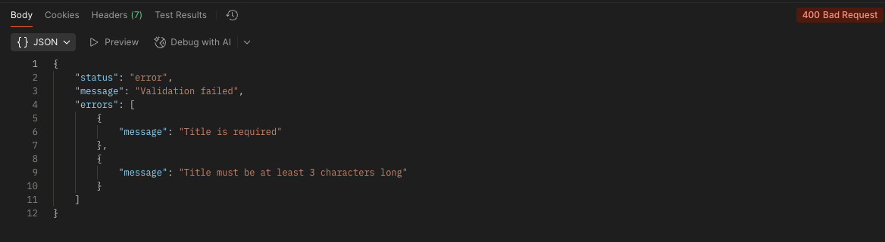

# Lab №3: Authentication and Authorization

## Project Background

The current project is a continuation of the development started in the [node-toDo-app-db](https://github.com/acetvertacova/node-toDo-app-db) repository.

---

## 🎯 Objective

- Learn methods of authentication and authorization in backend applications using Node.js.
- Implement REST API protection using JWT (JSON Web Token).
- Learn to restrict access to resources based on user roles.


---

## Installation and Project Launch Instructions

1. Install Node.js

    Make sure you have Node.js installed. Check your version:
   
```
    node -v
    npm -v
```

2. Clone or Download the Project

```
   git clone <repo-url>
   cd <your-project-folder>
```

3. Install Dependencies

```
    npm install
```

4. Run migrations

```
    npx sequelize-cli db:migrate
```

5. Start the server

```
    npm run dev
```

---

## Project's Structure

    node-toDo-app-db/
    ├── config/
    │   └── config.js                    # Database configuration for Sequelize
    ├── middleware/                      # Custom middleware 
    │   └── auth.js                      
    │
    ├── controllers/
    │   ├── CategoriesController.js      # Handles category-related logic
    │   ├── UserController.js            # Handles user-related logic
    │   └── TodoController.js            # Handles todo-related logic
    │
    ├── migrations/
    │   ├── 20251026143524-create-category.js  # Migration for creating 'Category' table
    │   ├── 20251026143744-create-user.js      # Migration for creating 'User' table
    │   └── 20251026143745-create-todo.js      # Migration for creating 'Todo' table
    │
    ├── models/
    │   ├── category.js                  # Sequelize model for Category
    │   ├── user.js                      # Sequelize model for User
    │   ├── todo.js                      # Sequelize model for Todo
    │   └── index.js                     # Model initialization and associations
    │
    ├── routes/
    │   ├── CategoryRoute.js             # Routes for categories
    │   ├── UserRoute.js                 # Routes for users
    │   ├── TodoRoute.js                 # Routes for todos
    │   └── swaggerDocs.js               # Swagger documentation routes
    │
    ├── seeders/
    │   ├── 20251026151718-demo-categories.js  # Seeds demo data for categories
    │   ├── 20251026151812-demo-user.js        # Seeds demo data for users
    │   └── 20251026151800-demo-todos.js       # Seeds demo data for todos
    │
    ├── swagger/
    │   └── swagger.js                   # Swagger configuration for API docs
    │
    ├── .gitignore                       # Git ignore file
    ├── app.js                           # Main entry point of the application
    ├── example.env                      # Example environment configuration
    ├── package.json                     # Project metadata and dependencies
    ├── package-lock.json                # Dependency lock file
    └── README.md                        # Project documentation

---

## Example Usage

---

### Step 1: Database 


Add a new `users` table and establish a relationship with the `todos` table.

### Users Table

| Field       | Type         | Description                        |
|------------ |------------ |---------------------------------- |
| id          | SERIAL (PK) | Unique identifier for the user     |
| username    | VARCHAR(50) | Unique username                    |
| email       | VARCHAR(100)| User email (unique)                |
| password    | TEXT        | Password hash                      |
| role        | VARCHAR(20) | User role (`user`, `admin`)        |
| created_at  | TIMESTAMP   | Registration date                  |
| updated_at  | TIMESTAMP   | Last update date                   |

### Changes in `todos` Table
Add a `user_id` field to link each task to its owner:

| Field    | Type        | Description                                        |
|----------|------------ |----------------------------------------------------|
| user_id  | INTEGER (FK)| Foreign key referencing `users` table (task owner) |

---

### Step 2: Authentication Implementation

Add authentication routes under `/api/auth`

| Method | URL                  | Description                               | Response       |
|--------|---------------------|--------------------------------------------|----------------|
| POST   | /api/auth/register  | Register a new user                        | 201 Created    |
| POST   | /api/auth/login     | User login (receive JWT token)             | 200 OK         |
| GET    | /api/auth/profile   | Get current user info (by token)           | 200 OK         |

---

### Registration (`POST /register`)

```javascript
// register function
export async function register(req, res) {
    try {
        const { username, email, password } = req.body;
        const hashedPassword = await bcrypt.hash(password, 10);

        const existingUser = await User.findOne({
            where: { [Op.or]: [{ email }, { username }] }
        });

        if (existingUser) {
            throw new Error('Username or email already in use');
        }

        const user = new User({ username, email, password: hashedPassword });
        await user.save();
        res.status(201).json({ message: 'User registered successfully' });
    } catch (error) {
        res.status(500).json({ error: 'Registration failed' });
    }
}
```

# Example: Register
POST /api/auth/register
Content-Type: application/json

{
  "username": "john_doe",
  "email": "john@example.com",
  "password": "securePassword123"
}

---

### Login (`POST /login`)
1. Check that the user exists and the password is correct.
2. Generate a JWT token containing:
   - `userId`
   - `username`
   - `role`
3. Return the token in the response.

```javascript
// login function
export async function login(req, res) {
    const { username, password } = req.body;
    const user = await User.findOne({ where: { username } });

    if (!user) return res.status(401).send("Credentials are wrong");

    const passwordMatch = await bcrypt.compare(password, user.password);
    if (!passwordMatch) return res.status(401).send("Credentials are wrong");

    const payload = { id: user.id, username: user.username, role: user.role };
    const token = jwt.sign(payload, SECRET_KEY, { expiresIn: "15m" });
    res.json({ token });
}
```

### Example: Login

POST /api/auth/login

Content-Type: application/json

{

  "username": "john_doe",
  
  "password": "securePassword123"
  
}

---

### Profile (`GET /profile`)

1. Pass the token in the `Authorization` header:  `Authorization: Bearer <token>`
2. If the token is valid, return the user information.
3. If invalid, return status `401 Unauthorized`.

```javascript
// getProfile function
export async function getProfile(req, res) {
    const user = await User.findByPk(req.user.id, { attributes: { exclude: ['password'] } });
    if (!user) return res.status(401).json({ message: "User not found" });
    res.json(user);
}
```

### Example: Get Profile

GET /api/auth/profile

Authorization: Bearer <JWT_TOKEN>

---

### Step 3: Authorization Implementation

### Role-Based Access Control

- **User (`role = user`)**
  - Can create tasks (`POST /api/todos`)
  - Can view tasks (`GET /api/todos`)

- **Admin (`role = admin`)**
  - Full access to all tasks (`CRUD /api/todos`)
  - Manage categories (`CRUD /api/categories`)

---

### Middleware: auth.middleware.js

```javascript
import jwt from 'jsonwebtoken';
import db from '../models/index.js';
const Todo = db.Todo;

const SECRET_KEY = process.env.JWT_SECRET || 'your_secret_key';

// Authenticate JWT
export function authenticateJWT(req, res, next) {
    const authHeader = req.headers["authorization"];
    if (!authHeader) return res.sendStatus(401);

    const token = authHeader.split(" ")[1];
    try {
        const payload = jwt.verify(token, SECRET_KEY);
        req.user = payload;
        next();
    } catch (err) {
        return res.status(401).json({ message: 'Invalid token' });
    }
}
```

---

```javascript
// Admin-only access
export function isAdmin(req, res, next) {
    if (!req.user) return res.status(401).json({ message: 'Unauthorized' });
    if (req.user.role !== 'admin') return res.status(403).json({ message: 'Forbidden: Admins only' });
    next();
}
```

---

```javascript
// Owner or Admin access
export async function isOwnerOrAdmin(req, res, next) {
    const user = req.user;
    const todoId = req.params.id;

    if (!user) return res.status(401).json({ message: 'Unauthorized' });

    const todo = await Todo.findByPk(todoId);
    if (!todo) return res.status(404).json({ message: 'Task not found' });

    if (user.role === 'admin' || todo.user_id === user.id) return next();

    return res.status(403).json({ message: 'Forbidden: Not owner or admin' });
}
```

---

### Example Usage in Routes

```javascript
// Users
todoRouter.get('/', authenticateJWT, todoController.getAll);
todoRouter.post('/', authenticateJWT, todoController.create);

// Owners or Admins
todoRouter.get('/:id', authenticateJWT, isOwnerOrAdmin, todoController.getById);

// Admin only
todoRouter.put('/:id', authenticateJWT, isAdmin, todoController.update);
todoRouter.delete('/:id', authenticateJWT, isAdmin, todoController.remove);
todoRouter.patch('/:id/toggle', authenticateJWT, isAdmin, todoController.toggleCompleted);
```

---

## Step 4: Testing and Demonstration

### 1. Register Users


### 1. Login Users

```http
POST /api/auth/login
Content-Type: application/json

{
  "username": "admin",
  "password": "adminpass"
}
```


---

```http
POST /api/auth/login
Content-Type: application/json

{
  "username": "alice",
  "password": "password123"
}
```


### 3. Test Scenarios

a) User creates a task (success)

```http
POST /api/todos
Authorization: Bearer <USER_JWT_TOKEN>
Content-Type: application/json

{
  "title": "Finish writing ORM lab report",
  "category_id": 2
}
```

Response: 201 Created


---

b) User tries to delete a task (forbidden)

```http
DELETE /api/todos/<uuid>
Authorization: Bearer <USER_JWT_TOKEN>
```

Response: 403 Forbidden


---

c) Admin updates/deletes any task (success)

```http
PUT /api/todos/<uuid>
Authorization: Bearer <ADMIN_JWT_TOKEN>
Content-Type: application/json

{
  "title": "test",
  "completed": true,
  "category_id": 1
}
```

Response: 200 OK


---

```http
DELETE /api/todos/<uuid>
Authorization: Bearer <ADMIN_JWT_TOKEN>
```

Response: 204 No Content


---

## Error Handling, Validation, and Logging

### 1. Centralized Error Handling

The application uses a centralized error handling system to provide consistent JSON responses for all errors. Custom error classes include:

- `AppError` – Base class for all operational errors.  
- `AuthenticationError` – For authentication failures (HTTP 401, 403).  


- `NotFoundError` – For resources that cannot be found (HTTP 404).  


- `ValidationError` – For validation failures (HTTP 400).  
- `CategoryNotFoundError`, `ToDoNotFoundError`, `UserNotFoundError` – Specific resource-related errors.  

> **Note:** Asynchronous route handlers use an `asyncWrapper` utility to catch all exceptions and forward them to the global error handler.

---

### 2. Data Validation

Request data is validated using **express-validator**. Each route that accepts user input defines a validation schema. Example for creating a task:

- `title` – Required, trimmed, minimum 3 characters.  
- `category_id` – Optional, must be a positive integer if provided.  

Validation errors are caught by the `handleValidationErrors` middleware and returned in the unified JSON format.



---

### 3. Logging

Logging is implemented using **winston** to track important events and errors. Features include:

- Logs all errors with request details, HTTP method, and path.  
- Supports file-based logging with rotation (e.g., `winston-daily-rotate-file`) or external logging services.  
- Can log successful requests, validation errors, and server errors based on configuration.

```javascript
{
    "level":"error",
    "message":"Request failed",
    "method":"POST",
    "path":"/api/todos",
    "requestId":"81e953be-f94e-412f-b96a-dd581f4b8516",
    "statusCode":400,
    "timestamp":"2025-11-15 23:44:05"
    }
```

---

## Control Questions?


### 1. What is JWT and how does it work?

 A JSON Web Token (JWT) is a secure way to send information between a client and a server. It is mainly used in web applications and APIs to verify users and prevent unauthorized access. A JWT is JSON data secured with a cryptographic signature. Consists of three parts: **header**, **payload**, **signature**.  

### 2. How to securely store user passwords?

- Use **bcrypt** or a similar library to hash passwords.  
- Never store passwords in plain text.  
- Hash the password before saving it to the database and verify it during login with `bcrypt.compare()`.  
- Optionally, use a **salt** to increase security. 

### 3. What is the difference between authentication and authorization?

- **Authentication** — verifying the identity of the user (e.g., login and password).  
- **Authorization** — checking the user’s permissions to access resources (e.g., user vs admin role).  
- Simple way to remember: **Authentication = Who are you?**, **Authorization = What can you do?**  

### 4. What are the advantages and disadvantages of using Passport.js for authentication in Node.js?

**Advantages:**  

One of the main benefits of passport.js is that it abstracts away the complexity of handling different authentication methods and protocols. You don't have to worry about the details of encrypting passwords, generating tokens, validating credentials, or redirecting users.

**Disadvantages:**  

Can be complex for beginners due to strategies and serialization. Sometimes overkill for simple JWT-based apps. Adds an extra dependency and configuration overhead.  

### 5. Advantages of Centralized Error Handling in Express

- **Consistency of responses:** All errors are returned in a unified JSON format, making it easier for frontend or client applications to handle them.  
- **Simplified route code:** No need to write repetitive `try/catch` blocks in every route, especially for asynchronous operations.  
- **Management of different error types:** Custom error classes (e.g., `NotFoundError`, `ValidationError`, `AuthenticationError`) allow easy differentiation and handling of various situations.  
- **Easier logging and monitoring:** All errors pass through a single handler, simplifying log management and integration with monitoring systems.  

### 6. Logging Categories and Reasoning

The system tracks the following log categories:

1. **Server errors (`error`)**  
   - Unexpected errors that require developer attention.  
   - Helps quickly identify and fix bugs.  
 
2. **Successful requests (`info`)**  
   - Tracks API activity for auditing and statistics.  
   - Helps analyze frequently used routes or features.  

**Reasoning:**  
This set covers key events: internal problems, user mistakes, and normal application activity, balancing useful insights and log volume.

### 7. Approaches to Data Validation in Express

Common approaches:

1. **Manual validation using `if` and `throw`**  
   - Simple checks directly in route handlers.  
   - Drawback: code duplication and poor scalability.  

2. **Validation libraries**  
   - **express-validator** – route-level validators using chains, integrates well with middleware.  
   - **Joi** – schema-based validation of entire objects, more declarative.  
   - **zod** – modern library for TypeScript/JS, supports validation and type inference.  

**Approach used in this project:**  
- **express-validator** is used for route validation (`createTaskValidationSchema`, `getAllTasksValidationSchema`, ...).  
- Validation errors are automatically forwarded to the global error handler via `handleValidationErrors`.  
- Provides detailed error messages for each field.
---

## Useful Links

- [JWT (JSON Web Token) – GeeksforGeeks](https://www.geeksforgeeks.org/web-tech/json-web-token-jwt/) – Overview of JWTs and how they work.
- [How to Store Passwords in a Database – GeeksforGeeks](https://www.geeksforgeeks.org/dbms/store-password-database/) – Secure password storage methods.
- [Difference Between Authentication and Authorization – GeeksforGeeks](https://www.geeksforgeeks.org/computer-networks/difference-between-authentication-and-authorization/) – Explains the difference between authn and authz.
- [Benefits and Drawbacks of Using Passport.js for Authentication – LinkedIn Advice](https://www.linkedin.com/advice/0/what-benefits-drawbacks-using-passportjs-authentication) – Pros and cons of Passport.js.
- [Server-side Applications Authentication Example – GitHub MSU-Courses](https://github.com/MSU-Courses/development-server-side-applications/tree/main/08_Auth) – Example project for implementing authentication.
- [What is the purpose of the express-validator middleware in Express JS?
](https://www.geeksforgeeks.org/node-js/what-is-the-purpose-of-the-express-validator-middleware-in-express-js/)
- [Efficient Log Rotation in Node.js with Winston and File Rotation](https://medium.com/@jagadeeshgade008/efficient-log-rotation-in-node-js-with-winston-and-file-rotation-9bf94075d699)


